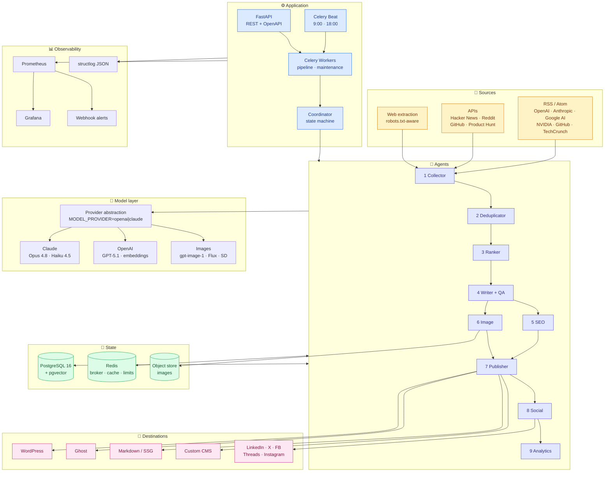
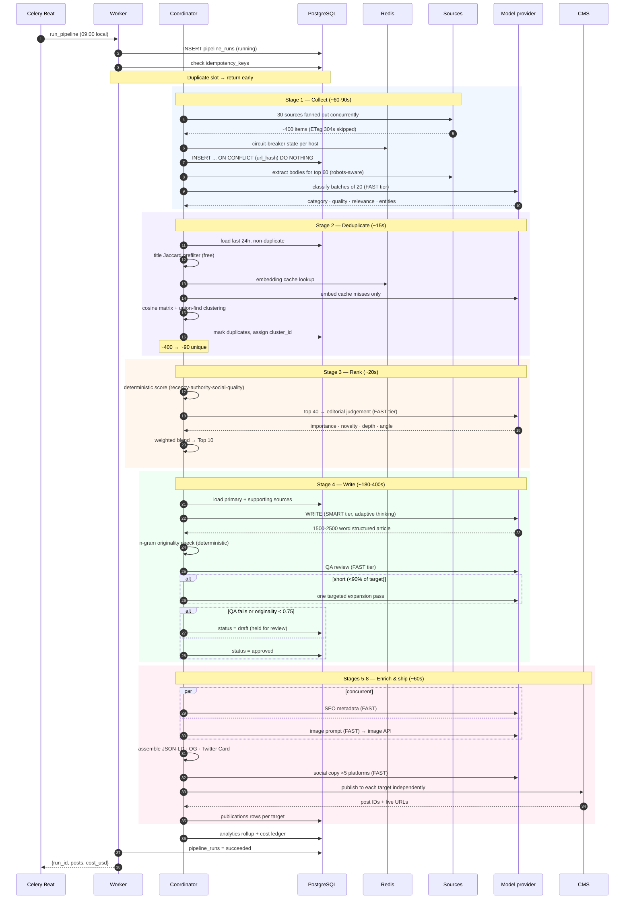
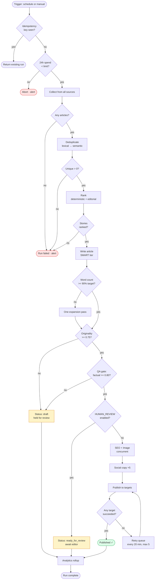
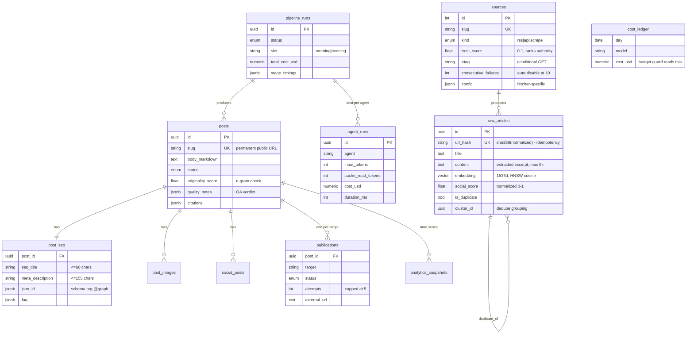
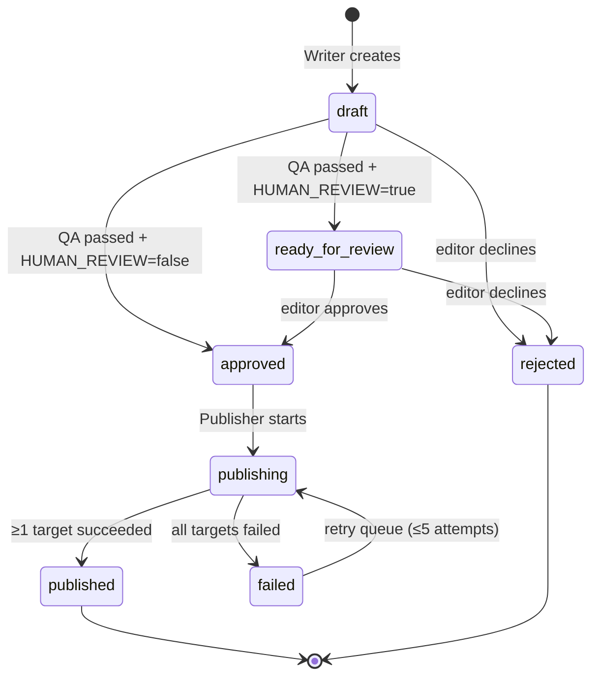
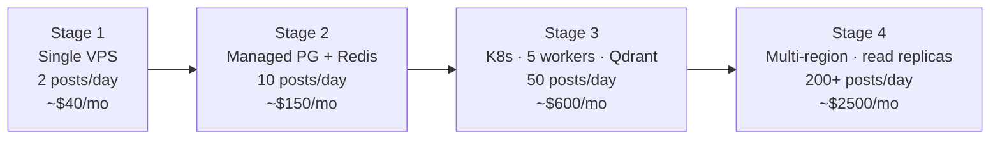

# AutoBlog — Engineering Blueprint

Complete build specification for the AI tech-blog automation platform.
Every section maps to code in this repository.

**Contents**
1. [High-level architecture](#1-high-level-architecture)
2. [System design](#2-system-design)
3. [Database schema](#3-database-schema)
4. [Folder structure](#4-folder-structure)
5. [API design](#5-api-design)
6. [Agent architecture](#6-agent-architecture)
7. [Scheduler](#7-scheduler)
8. [Prompt templates](#8-prompt-templates)
9. [Publishing workflow](#9-publishing-workflow)
10. [Deployment guide](#10-deployment-guide)
11. [Docker setup](#11-docker-setup)
12. [Security](#12-security)
13. [Scaling strategy](#13-scaling-strategy)
14. [Cost estimation](#14-cost-estimation)
15. [Future improvements](#15-future-improvements)

---

## 1. High-level architecture



### Component responsibilities

| Component | Responsibility | Scales by |
|---|---|---|
| FastAPI | REST API, health, manual triggers, admin | Horizontal (stateless) |
| Celery Beat | Cron scheduling — **exactly one replica** | Never (singleton) |
| Celery Worker | Executes pipeline + maintenance tasks | Horizontal |
| Coordinator | Deterministic pipeline state machine | Within worker |
| PostgreSQL | All state + vector index | Vertical, then read replicas |
| Redis | Broker, embedding cache, rate limits, circuit breakers | Vertical, then Cluster |
| Provider layer | Vendor-agnostic LLM access | N/A |

### Key design decisions

| Decision | Rationale | Alternative rejected |
|---|---|---|
| Deterministic coordinator, not an LLM planner | Steps never vary. A planner adds cost, latency and nondeterminism, and makes mid-pipeline resume impossible. | LLM orchestrator |
| pgvector by default | One datastore, transactional consistency with articles, HNSW handles low millions of rows. | Dedicated vector DB from day one |
| Two model tiers (SMART/FAST) | Writing needs frontier quality; classification and ranking do not. ~70% cost reduction. | Single model everywhere |
| Structured outputs everywhere | Provider-enforced JSON. No regex-scraping prose. | Free-text + parsing |
| n-gram originality check | A prompt saying "be original" is a request; an n-gram check is a measurement. | Prompt-only |
| Per-target `publications` rows | WordPress failing must not roll back a successful Ghost publish. | Single status on post |
| Idempotency keys on runs | A double-fired scheduler would otherwise publish two editions. | Hope |

---

## 2. System design

### Sequence — one full publish cycle



### Pipeline flowchart with failure paths



### Failure policy

| Agent | Optional | On failure |
|---|:---:|---|
| Collector | ✗ | Abort run. Individual source failures are isolated and logged. |
| Deduplicator | ✗ | Abort run (falls back to lexical-only if embeddings fail). |
| Ranker | ✗ | Abort run (falls back to deterministic-only if LLM fails). |
| Writer | ✗ | Abort that post; other stories in the run continue. |
| SEO | ✓ | Log, mark run `partial`, publish without metadata. |
| Image | ✓ | Log, publish without a hero image. |
| Social | ✓ | Log, publish without social copy. |
| Publisher | ✗ | Per-target retry queue; any success ⇒ published. |
| Analytics | ✓ | Log only. |

---

## 3. Database schema



### Index strategy

| Index | Type | Serves |
|---|---|---|
| `raw_articles.url_hash` | unique btree | Ingest idempotency (`ON CONFLICT DO NOTHING`) |
| `ix_raw_articles_embedding_hnsw` | HNSW cosine | Semantic dedupe; `m=16, ef_construction=64` |
| `ix_raw_articles_title_trgm` | GIN trigram | Lexical prefilter before paying for embeddings |
| `ix_raw_articles_dupe` | composite | `WHERE is_duplicate=false ORDER BY published_at` |
| `posts.slug` | unique btree | Public URL lookup; collisions get a suffix |
| `uq_publication_target` | unique | One row per (post, target); enables safe retry |
| `uq_cost_day_model` | unique | Upsert target for the cost ledger |

### Retention

| Table | Retention | Reason |
|---|---|---|
| `raw_articles` | 90 days | Bulk of row count, no value once ranked |
| `pipeline_runs` (failed) | 180 days | Debugging window |
| `analytics_snapshots` | 400 days | Year-over-year comparison |
| `posts`, `publications` | Forever | Published record |

---

## 4. Folder structure

```
Auto Blog Post/
├── README.md
├── Makefile                       # every operation is one make target
├── pyproject.toml
├── alembic.ini
├── docker-compose.yml
├── .env.example
│
├── docs/
│   └── BLUEPRINT.md               # this file
│
├── docker/
│   ├── Dockerfile                 # multi-stage, non-root, tini
│   ├── prometheus.yml
│   ├── alerts.yml
│   └── nginx/nginx.conf
│
├── migrations/                    # Alembic
│   ├── env.py
│   └── versions/0001_initial_schema.py
│
├── backend/
│   ├── app/
│   │   ├── main.py                # FastAPI entrypoint
│   │   ├── config.py              # all settings, env-driven
│   │   │
│   │   ├── api/v1/routes.py       # health · runs · posts · sources · analytics
│   │   ├── schemas/api.py         # Pydantic contracts
│   │   │
│   │   ├── core/
│   │   │   ├── logging_conf.py    # structlog JSON + run_id context
│   │   │   ├── resilience.py      # retry · rate limit · circuit breaker
│   │   │   ├── metrics.py         # Prometheus definitions
│   │   │   └── security.py        # API key · SSRF guard
│   │   │
│   │   ├── db/
│   │   │   ├── models.py          # SQLAlchemy 2.0 + pgvector
│   │   │   └── session.py         # async engine, sync bridge for Celery
│   │   │
│   │   ├── llm/
│   │   │   ├── base.py            # provider-agnostic interface
│   │   │   ├── anthropic_provider.py
│   │   │   ├── openai_provider.py
│   │   │   ├── pricing.py         # token pricing table
│   │   │   └── factory.py         # selection + budget guard
│   │   │
│   │   ├── agents/                # ← the 10 agents
│   │   │   ├── base.py            # timing · metrics · cost accounting
│   │   │   ├── collector.py
│   │   │   ├── deduplicator.py
│   │   │   ├── ranker.py
│   │   │   ├── writer.py          # + originality + QA gate
│   │   │   ├── seo.py
│   │   │   ├── image_agent.py
│   │   │   ├── publisher.py
│   │   │   ├── social.py
│   │   │   ├── analytics.py
│   │   │   └── coordinator.py     # deterministic state machine
│   │   │
│   │   ├── prompts/templates.py   # every prompt + JSON schema
│   │   │
│   │   ├── services/
│   │   │   ├── source_registry.py # 30 seed sources
│   │   │   ├── embeddings.py      # cache-through embedding
│   │   │   ├── vector.py          # pgvector | Qdrant
│   │   │   ├── fetchers/          # rss · api_sources · scraper
│   │   │   ├── images/providers.py
│   │   │   └── publishers/        # base · targets
│   │   │
│   │   ├── workers/
│   │   │   ├── celery_app.py      # queues + beat schedule
│   │   │   └── tasks.py
│   │   │
│   │   └── scripts/dry_run.py
│   └── tests/
│
└── frontend/                      # React reader UI
    ├── package.json
    ├── vite.config.js
    ├── tailwind.config.js
    └── src/
        ├── App.jsx
        ├── lib/api.js
        ├── components/            # Layout · PostCard · Markdown · …
        └── pages/                 # Home · PostDetail · Dashboard
```

---

## 5. API design

Base: `/api/v1`. Reads are open; every mutation requires `X-API-Key`.

### Endpoints

| Method | Path | Auth | Purpose |
|---|---|:---:|---|
| GET | `/health` | — | Liveness (dependency-free) |
| GET | `/health/ready` | — | Readiness (DB + Redis) |
| GET | `/health/deep` | — | **Business health** — are we publishing? |
| POST | `/runs` | 🔑 | Queue a pipeline run → 202 + task id |
| GET | `/runs` | — | List runs |
| GET | `/runs/{id}` | — | Run detail with stage timings |
| GET | `/posts` | — | List (filter: status, category) |
| GET | `/posts/{id}` | — | Full post + SEO + images + social |
| GET | `/posts/{id}/preview` | — | Rendered HTML as the CMS receives it |
| PATCH | `/posts/{id}/status` | 🔑 | Editorial approve / reject |
| POST | `/posts/{id}/publish` | 🔑 | Publish an approved post |
| GET | `/sources` | — | List sources |
| POST | `/sources` | 🔑 | Add a source (no deploy needed) |
| PATCH | `/sources/{id}` | 🔑 | Update trust score / enable |
| DELETE | `/sources/{id}` | 🔑 | Remove |
| POST | `/sources/seed` | 🔑 | Load the seed registry |
| GET | `/analytics/costs` | — | Spend + projection |
| GET | `/analytics/pipeline` | — | Success rate, duration, compression |
| GET | `/analytics/articles/top` | — | Current candidate pool with scores |
| GET | `/metrics` | internal | Prometheus |

### Examples

**Trigger a run**
```bash
curl -X POST http://localhost:8000/api/v1/runs \
  -H "X-API-Key: $ADMIN_API_KEY" \
  -H "Content-Type: application/json" \
  -d '{"trigger": "manual", "posts": 2}'
```
```json
{ "task_id": "8f3c…", "status": "queued",
  "message": "pipeline queued (trigger=manual); poll GET /runs/{id}" }
```

**Deep health — the check that should page someone**
```bash
curl http://localhost:8000/api/v1/health/deep
```
```json
{
  "status": "ok",
  "checks": {
    "last_run_at": "2026-07-23T09:00:12Z",
    "last_run_status": "succeeded",
    "posts_published_24h": 2,
    "spend_24h_usd": 1.83,
    "budget_limit_usd": 25.0,
    "enabled_sources": 29
  }
}
```

**Cost report**
```bash
curl "http://localhost:8000/api/v1/analytics/costs?days=30"
```
```json
{
  "period_days": 30, "total_cost_usd": 54.20,
  "cost_per_post_usd": 0.903, "posts_published": 60,
  "projected_monthly_usd": 54.20, "budget_limit_usd": 750.0,
  "breakdown": [
    {"provider":"claude","model":"claude-opus-4-8","category":"llm",
     "requests":60,"input_tokens":1080000,"output_tokens":390000,"cost_usd":41.15},
    {"provider":"claude","model":"claude-haiku-4-5","category":"llm",
     "requests":420,"input_tokens":2600000,"output_tokens":310000,"cost_usd":4.15},
    {"provider":"openai","model":"text-embedding-3-small","category":"embedding",
     "requests":180,"input_tokens":4200000,"output_tokens":0,"cost_usd":0.08}
  ]
}
```

**Editorial approve then publish** (`HUMAN_REVIEW=true`)
```bash
curl -X PATCH .../posts/$ID/status -H "X-API-Key: $KEY" \
  -d '{"status":"approved","note":"verified the benchmark numbers"}'
curl -X POST .../posts/$ID/publish -H "X-API-Key: $KEY"
```

### Status codes

| Code | Meaning |
|---|---|
| 202 | Accepted — async work queued |
| 401 | Missing/invalid `X-API-Key` (constant-time compare) |
| 404 | Not found |
| 409 | Conflict — already published, or wrong status for the transition |
| 500 | Internal — logged with full trace, never leaked to the client |

---

## 6. Agent architecture

Every agent subclasses `Agent[TIn, TOut]` and implements `execute()`. The base
class owns timing, structured logging, Prometheus metrics, cost accounting and
persistence of an `agent_runs` row — so every token spent anywhere is
attributable to a specific agent in a specific run.

| # | Agent | Tier | Typical duration | Typical cost | Optional |
|---|---|---|---|---|:---:|
| 1 | Collector | FAST | 60-90 s | $0.02 | ✗ |
| 2 | Deduplicator | embeddings | 10-20 s | $0.002 | ✗ |
| 3 | Ranker | FAST | 15-25 s | $0.01 | ✗ |
| 4 | Writer + QA | **SMART** | 180-400 s | **$0.60-0.80** | ✗ |
| 5 | SEO | FAST | 10-15 s | $0.01 | ✓ |
| 6 | Image | FAST + image API | 20-40 s | $0.05 | ✓ |
| 7 | Publisher | none | 5-15 s | $0 | ✗ |
| 8 | Social | FAST | 10-20 s | $0.01 | ✓ |
| 9 | Analytics | none | < 1 s | $0 | ✓ |
| 10 | Coordinator | none | — | — | — |

### Notable internals

**Deduplicator — three-stage funnel, cheapest filter first**
1. Exact `url_hash` (free, at ingest)
2. Title Jaccard ≥ 0.75 (free) — catches syndicated copies before embedding
3. Cosine ≥ `DEDUPE_SIMILARITY_THRESHOLD` — catches the same story written up
   independently under six different headlines

Clustering is single-link agglomerative via union-find over the similarity
matrix. At ~500 articles the matrix is ~1 MB and a few milliseconds. Cluster
representative is chosen by source authority × quality × recency × has-body.

**Ranker — hybrid, and auditable**

```
score = Σ wᵢ·componentᵢ  ×  (0.7 + 0.3·audience_fit)

deterministic          editorial (LLM)
  recency    0.20        importance  0.20
  authority  0.15        novelty     0.10
  social     0.15        depth       0.10
  quality    0.10
```
Recency decays exponentially with a **12-hour half-life** (verified: 0h→1.00,
12h→0.50, 24h→0.25, 48h→0.06). Every Top-10 entry stores its component scores,
so "why did this lead?" always has an answer.

**Writer — two-layer verification**

| Layer | Method | Gate |
|---|---|---|
| Deterministic | 7-gram overlap vs. source text | originality ≥ 0.75 |
| LLM QA | factual grounding, AI-voice, structure | factual ≥ 0.80, `publishable` |

Measured behaviour: verbatim copy → 0.00 (blocked), light paraphrase → 0.62
(blocked), genuinely original analysis → 1.00 (passes). Failing either gate
sets the post to `draft` and holds it for review rather than publishing.

If word count lands below 90% of target, one **targeted expansion pass** runs
instead of a full regeneration — cheaper, and it keeps the parts that worked.

---

## 7. Scheduler

Celery Beat, driven by one env var:

```bash
SCHEDULE="0 9,18 * * *"     # 9:00 AM and 6:00 PM
TIMEZONE="Asia/Kolkata"     # any IANA zone
```

| Job | Cadence | Purpose |
|---|---|---|
| `run_pipeline` | `SCHEDULE` | The publish cycle |
| `retry_failed_publications` | every 20 min | Publish retry queue (max 5 attempts) |
| `refresh_sources` | every 6 h | Re-enable sources after a recovered outage |
| `pull_analytics` | daily 03:30 | Traffic metrics per published post |
| `prune` | weekly | Retention sweep |
| `export_queue_depth` | 60 s | Queue depth → Prometheus |

**Double-fire protection.** Each scheduled run derives an idempotency key of
`pipeline:{YYYY-MM-DD}:{morning|evening}`. If beat restarts at the fire minute,
or two beat processes exist, the second run returns the first run's ID instead
of publishing a second edition. Entries also carry
`options: {expires: 1800}` so a run that would fire an hour late is dropped.

> ⚠️ **Run exactly one beat replica.** Two beats means two editions per slot.
> The compose file pins `replicas: 1`; on Kubernetes use a `Deployment` with
> `replicas: 1` and `strategy: Recreate`.

Changing the schedule: edit `SCHEDULE`, restart `beat`. No code change.

---

## 8. Prompt templates

All prompts live in `backend/app/prompts/templates.py`. Four principles:

1. **Stable system prefix, volatile user turn.** System prompts are long and
   byte-identical across a run — that is what makes prompt caching pay off.
   Today's stories go in the user turn, after the cached prefix.
2. **Schema-enforced output.** Every structured stage declares a JSON schema
   and lets the provider enforce it.
3. **Concrete bans, not vibes.** "Sound human" does nothing. A list of banned
   constructions works.
4. **Verify, don't trust.** Originality is stated in the prompt *and* measured
   downstream.

### The anti-AI-voice block (excerpt)

```
HARD BANS:
- Openers: "In today's rapidly evolving...", "In an era where..."
- Fillers: "Moreover", "Furthermore", "It's important to note"
- Empty intensifiers: "revolutionary", "game-changing", "seamlessly",
  "leverage" (verb), "delve into", "unlock the potential"
- The "It's not just X, it's Y" construction
- Closing paragraphs that summarize without adding anything

CRAFT:
- Vary sentence length deliberately. A short one lands the point.
- Active voice, concrete subjects. "Anthropic shipped X".
- Contractions are fine and usually better.
- Never use an em dash where a comma or full stop works.
```

### Writer output contract

| Field | Constraint |
|---|---|
| `title` | 55-70 chars, names the subject, no clickbait |
| `subtitle` | 90-140 chars, adds information the title lacks |
| `executive_summary` | 2-3 sentences, standalone value |
| `body_markdown` | **1500-2500 words**, `##`/`###` only, 5-8 sections |
| `highlights` | 4-6 complete statements |
| `expert_opinion` | 150-250 words, opinionated, defended |
| `industry_impact` | 150-250 words, concrete effects |
| `future_predictions` | 150-250 words, 2-4 **falsifiable** predictions |
| `key_takeaways` | 3-5 actionable bullets |
| `citations` | 3-6 inline markdown links on natural phrases |

### Prompt-caching layout

```
┌───────────────────────────────────────────┐
│ HOUSE_STYLE + task rules   ← cache_control│  ~1,800 tokens, cached
├───────────────────────────────────────────┤
│ Assignment · angle                        │
│ Primary source (title, publisher, body)   │  volatile, not cached
│ Supporting sources ×N                     │
│ Recently published titles (anti-repeat)   │
└───────────────────────────────────────────┘
```
Cache reads cost ~0.1× input. Across ~7 LLM calls per post sharing the same
prefix, this is a measurable saving — verify with
`usage.cache_read_input_tokens`; if it is zero across a run, something is
invalidating the prefix.

---

## 9. Publishing workflow



### Targets

| Target | Auth | Notes |
|---|---|---|
| **WordPress** | Application Password (Basic) | Two-step: upload media → create post with `featured_media`. Sets Yoast meta fields. |
| **Ghost** | Admin API key → 5-min JWT | JSON-LD injected via `codeinjection_head`. |
| **Medium** | Integration token | API effectively frozen; new tokens unavailable. **Always sets `canonicalUrl`** so Medium does not outrank your own site. |
| **Custom CMS** | Bearer token | Full post envelope in one POST. |
| **Markdown** | none | YAML front matter for Hugo/Astro/Eleventy. **Default** — run end-to-end with zero credentials. |

Each target gets its own `publications` row with independent status, attempt
count and error. Any single success marks the post `published`.

Every rendered post carries an **AI disclosure** footer and a `Sources` section
with `rel="nofollow noopener"` links.

### Recommended rollout

```
Week 1   PUBLISH_TARGETS=markdown   PUBLISH_STATUS=draft   HUMAN_REVIEW=true
         → inspect /posts/{id}/preview, tune prompts and ranking weights
Week 2   PUBLISH_TARGETS=wordpress  PUBLISH_STATUS=draft   HUMAN_REVIEW=true
         → verify CMS formatting, images, SEO fields
Week 3   PUBLISH_STATUS=publish     HUMAN_REVIEW=true      → editor approves each
Week 4+  HUMAN_REVIEW=false                                → fully autonomous
```

---

## 10. Deployment guide

### Local (5 minutes)

```bash
make init                    # creates .env
$EDITOR .env                 # add ANTHROPIC_API_KEY + OPENAI_API_KEY
make build && make up
make migrate && make seed
make dry-run                 # collect+dedupe+rank only, costs ~$0.03
make run                     # full pipeline
open http://localhost:8000/docs
```

### Production — single VPS (4 vCPU / 8 GB, ~$40/mo)

```bash
# 1. Harden the host
ufw allow 22,80,443/tcp && ufw enable
adduser --disabled-password autoblog && usermod -aG docker autoblog

# 2. Deploy
git clone <repo> /opt/autoblog && cd /opt/autoblog
cp .env.example .env && $EDITOR .env      # ENV=prod, real keys, PUBLISH_STATUS=draft
chmod 600 .env

docker compose --profile production up -d --build
docker compose exec api alembic upgrade head
docker compose exec api python -c "from app.workers.tasks import seed_sources; seed_sources()"

# 3. Verify
curl -fsS https://yourdomain.com/api/v1/health/deep | jq
```

Traefik handles TLS via Let's Encrypt automatically (`--profile production`).

### Kubernetes sketch

```yaml
# Beat MUST be a singleton — two beats publish two editions per slot.
apiVersion: apps/v1
kind: Deployment
metadata: {name: autoblog-beat}
spec:
  replicas: 1
  strategy: {type: Recreate}
  template:
    spec:
      containers:
        - name: beat
          image: autoblog:1.0.0
          command: ["celery","-A","app.workers.celery_app","beat","--loglevel=info"]
          envFrom: [{secretRef: {name: autoblog-secrets}}]
---
apiVersion: apps/v1
kind: Deployment
metadata: {name: autoblog-worker}
spec:
  replicas: 2
  template:
    spec:
      containers:
        - name: worker
          image: autoblog:1.0.0
          command: ["celery","-A","app.workers.celery_app","worker",
                    "--concurrency=2","--queues=pipeline,maintenance"]
          resources:
            requests: {memory: 1Gi, cpu: 500m}
            limits:   {memory: 2Gi, cpu: 2000m}
---
apiVersion: apps/v1
kind: Deployment
metadata: {name: autoblog-api}
spec:
  replicas: 2                      # stateless, scale freely
  template:
    spec:
      containers:
        - name: api
          image: autoblog:1.0.0
          ports: [{containerPort: 8000}]
          livenessProbe:  {httpGet: {path: /api/v1/health, port: 8000}}
          readinessProbe: {httpGet: {path: /api/v1/health/ready, port: 8000}}
```

### Pre-flight checklist

- [ ] `ENV=prod` (disables `/docs`, `/openapi.json`)
- [ ] `SECRET_KEY` and `ADMIN_API_KEY` generated with `openssl rand -hex 32`
- [ ] `.env` is `chmod 600` and **not** in git
- [ ] `PUBLISH_STATUS=draft` for the first week
- [ ] `HUMAN_REVIEW=true` initially
- [ ] `DAILY_COST_LIMIT_USD` set conservatively
- [ ] `ALERT_WEBHOOK_URL` configured and tested
- [ ] Postgres backups: `pg_dump` daily, restore verified
- [ ] Exactly one beat replica confirmed
- [ ] TLS valid; `/metrics` not publicly reachable

---

## 11. Docker setup

**Image** — multi-stage, ~180 MB runtime:

| Layer | Choice | Why |
|---|---|---|
| Builder | `python:3.12-slim` + build-essential | Compiles wheels once |
| Runtime | `python:3.12-slim` + `libpq5` only | No compilers in the shipped image |
| User | non-root `app` | Writes only to `/data` |
| Init | `tini` | Reaps zombies from Celery's forked workers |
| Health | `curl /api/v1/health` | Container-level restart signal |

**Compose services**

| Service | Profile | Notes |
|---|---|---|
| `postgres` | default | `pgvector/pgvector:pg16`, tuned `shared_buffers`/`work_mem` |
| `redis` | default | AOF on, 512 MB, `allkeys-lru` |
| `api` | default | 2 uvicorn workers |
| `worker` | default | concurrency 2, both queues, `max-tasks-per-child=50` |
| `beat` | default | **replicas: 1** |
| `flower` | monitoring | Celery task inspector |
| `prometheus` / `grafana` | monitoring | 30-day retention |
| `traefik` | production | Automatic Let's Encrypt |
| `nginx` | production | Static media, rate limiting, security headers |

**Worker tuning rationale**
- `task_acks_late=true` + `reject_on_worker_lost=true` → a worker crash
  re-queues the edition instead of silently losing it.
- `worker_prefetch_multiplier=1` → no worker hoards 20-minute jobs.
- Separate `pipeline` / `maintenance` queues → a long writer call never blocks
  the 60-second queue-depth exporter.
- `soft_time_limit=45min` fires before `time_limit=50min`, giving the task a
  chance to mark the run failed cleanly.

---

## 12. Security

### Threat model and controls

| Threat | Control | Location |
|---|---|---|
| Unauthorized trigger/publish | `X-API-Key`, `hmac.compare_digest` (constant-time) | `core/security.py` |
| **SSRF via hostile feed entry** | Resolve + reject private/loopback/link-local IPs and dangerous ports before fetching | `assert_safe_url()` |
| Prompt injection from source text | Source content is data in the user turn; system prompt is fixed. Output is schema-constrained. Originality + QA gates run on the result. | `prompts/`, `writer.py` |
| Credential leakage | `.env` `chmod 600`, never logged, `redact()` helper, Sentry `send_default_pii=False` | throughout |
| Scraping liability | robots.txt honoured, 1 req/s per host, excerpt-only (6k cap), circuit breaker | `fetchers/scraper.py` |
| Cost exhaustion / runaway retries | Budget guard before each expensive stage; capped retries; per-provider rate limits | `llm/factory.py` |
| SQL injection | SQLAlchemy parameter binding everywhere, incl. the raw pgvector query | `services/vector.py` |
| XSS in rendered HTML | markdown-it with `html: false`; all interpolated values escaped | `publishers/base.py` |
| Metrics exposure | nginx allows RFC1918 only | `nginx.conf` |
| Stack-trace disclosure | Global handler returns `{"detail":"internal server error"}`, logs the trace | `main.py` |

### Secrets

Development uses `.env`. Production should use a real secret manager (AWS
Secrets Manager, Vault, Kubernetes Secrets with encryption at rest). Rotate
`ADMIN_API_KEY` quarterly; rotate provider keys on any suspected exposure.

### Content and legal

- **AI disclosure** on every published post — required by Google's guidance
  and simply correct.
- **Attribution**: 3-6 inline citations plus a Sources section.
- **Excerpt-only** storage, never full-text reproduction.
- **Canonical URLs** on syndicated copies (Medium), pointing home.
- **`stop_reason == "refusal"`** is handled explicitly rather than crashing on
  an empty content array.

---

## 13. Scaling strategy

### Current envelope (single VPS)

| Dimension | Capacity | First bottleneck |
|---|---|---|
| Posts/day | ~20 | LLM latency, not infrastructure |
| Sources | ~100 | Collection window |
| Articles retained | ~5 M | pgvector HNSW build time |
| Concurrent runs | 2-4 | Provider rate limits |

### Scaling ladder



| Trigger | Action |
|---|---|
| Queue depth > 10 for 20 min | Add worker replicas |
| Pipeline p90 > 40 min | Add workers; check provider rate limits |
| `raw_articles` > 5 M rows | Partition by month; consider Qdrant |
| Dedupe stage > 60 s | Switch `VECTOR_BACKEND=qdrant` (interface identical) |
| DB CPU > 70% sustained | Read replica for analytics queries |
| Multiple publications/verticals | Shard by tenant; one source registry per vertical |

**What scales trivially**: the API (stateless), workers (queue-based), the
vector store (interface abstracted).
**What does not**: Celery Beat is a singleton by design. Postgres is the shared
write path — scale it vertically first, then add read replicas.

---

## 14. Cost estimation

### Per post (Claude, 2 posts/day)

| Stage | Model | In | Out | Cost |
|---|---|---:|---:|---:|
| Classification (3 batches) | Haiku 4.5 | 24k | 6k | $0.054 |
| Embeddings (~150 new) | text-embedding-3-small | 45k | — | $0.001 |
| Ranking | Haiku 4.5 | 12k | 4k | $0.032 |
| **Writing** | **Opus 4.8** | **18k** | **6.5k** | **$0.253** |
| QA review | Haiku 4.5 | 14k | 1.5k | $0.022 |
| SEO | Haiku 4.5 | 8k | 1.2k | $0.014 |
| Image prompt | Haiku 4.5 | 1k | 0.4k | $0.003 |
| Image render | gpt-image-1 | — | — | $0.042 |
| Social ×5 | Haiku 4.5 | 3k | 2k | $0.013 |
| | | | **Total** | **≈ $0.43** |

Collection is amortized across posts in the same run, so a 2-post run costs
less than 2× a 1-post run.

### Monthly

| Cadence | LLM | Infra | **Total** |
|---|---:|---:|---:|
| 2 posts/day (60/mo) | ~$26 | $40 VPS | **~$66** |
| 5 posts/day (150/mo) | ~$65 | $150 managed | **~$215** |
| 20 posts/day (600/mo) | ~$260 | $600 K8s | **~$860** |

For comparison, a freelance technical writer charges $150-500 per
1,500-word article. At 60 posts/month that is $9,000-30,000.

### Cost optimization — implemented

| Technique | Where | Saving |
|---|---|---|
| **Two-tier models** | Opus writes; Haiku does the other 6 stages | ~70% |
| **Prompt caching** | `cache_control` on the stable system prefix | ~30% of input |
| **Embedding cache** | Redis content-hash, 30-day TTL | 60-80% of embedding calls |
| **Embedding reuse** | Skip articles already carrying a current-model vector | large |
| **Batch embeddings** | 96 per request, never one-at-a-time | 10× fewer requests |
| **Selective enrichment** | Only top 60 articles get body extraction + classification | ~85% |
| **Lexical prefilter** | Title Jaccard before paying for embeddings | ~30% |
| **Shortlist for ranking** | Only 40 candidates reach the LLM | ~90% |
| **Targeted expansion** | Repair short drafts instead of regenerating | ~50% of retry cost |
| **Conditional GET** | ETag/Last-Modified → 304s cost nothing | bandwidth + parse |
| **Parallel execution** | SEO ‖ image; all sources fanned out | wall-clock, not $ |
| **Retry with jitter** | Prevents thundering-herd 429 storms | avoided waste |
| **Budget guard** | Hard stop at `DAILY_COST_LIMIT_USD` | caps the blast radius |

### Further levers

```bash
ANTHROPIC_MODEL_SMART=claude-sonnet-5   # ~40% cheaper writing
ANTHROPIC_EFFORT=medium                 # fewer thinking tokens
IMAGE_PROVIDER=flux                     # $0.040 vs $0.042, better editorial style
IMAGE_PROVIDER=none                     # −$0.042/post; reuse source images
POSTS_PER_RUN=2                         # amortize collection further
```

---

## 15. Future improvements

### Near term (1-2 months)

| Improvement | Value |
|---|---|
| **Analytics → ranker feedback loop** | After ~30 posts, correlate category/source/slot against pageviews and auto-tune `WEIGHTS`. The single highest-value addition — turns a firehose into a system that learns. |
| **Native social posting** | Currently copy is generated and stored. Add LinkedIn/X APIs or a Buffer integration for true end-to-end. |
| **Multi-post series detection** | When one story warrants 3 articles, plan them together instead of 3 near-duplicates. |
| **Internal linking** | Vector search over published posts → auto-link related articles. Real SEO value, near-zero cost. |
| **Editor UI** | Approve/reject/edit in the browser (frontend scaffolded, see `frontend/`). |

### Medium term (3-6 months)

- **A/B testing** — generate 2 titles/hero images, publish variants, let CTR decide.
- **Newsletter digest** — weekly roundup assembled from the week's posts.
- **Fact-check agent with web search** — verify claims against live sources before publish.
- **Multi-language** — translate top posts; `hreflang` handled in the SEO agent.
- **Podcast/video scripts** — reuse the article as a TTS script.
- **Comment triage** — summarize and flag reader comments needing a response.

### Long term

- **Original research** — aggregate the corpus into trend reports nobody else has.
- **Multi-tenant SaaS** — source registry and prompts are already per-config; add tenancy.
- **Fine-tuned house-voice model** — after ~500 human-edited posts, fine-tune the FAST tier on accepted edits.
- **Predictive scheduling** — publish when *your* audience is actually reading, per analytics.

### Known limitations

| Limitation | Mitigation |
|---|---|
| Social copy is generated, not posted | Documented as an integration point |
| Analytics ships a Plausible adapter only | GA4 is a drop-in replacement for `_fetch_plausible` |
| Medium API is effectively frozen | Kept for existing tokens; not a primary target |
| No visual regression testing on rendered posts | Use `/posts/{id}/preview` during rollout |
| Ranking weights are hand-tuned | Feedback loop above is the fix |
| Single-writer bottleneck at high volume | Writer calls are independent; parallelize across posts |
